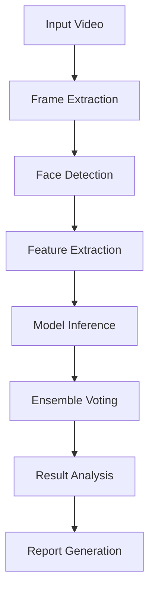
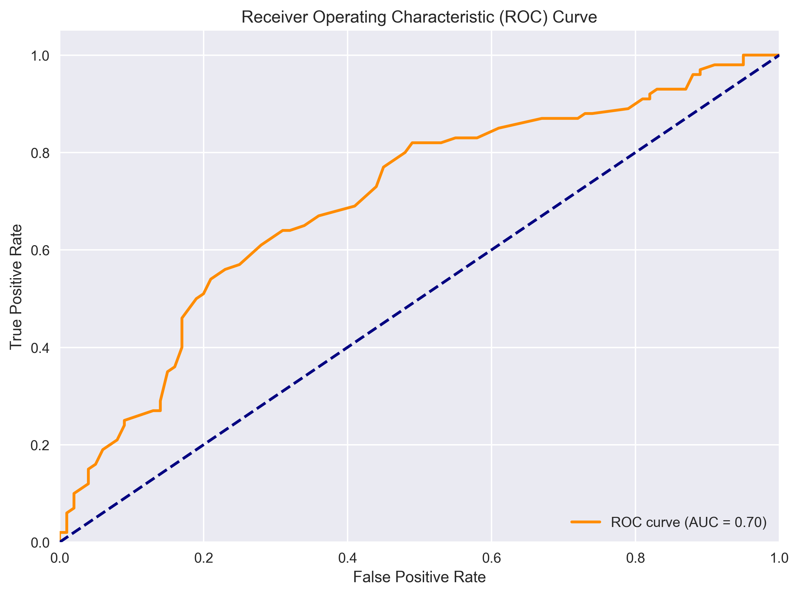
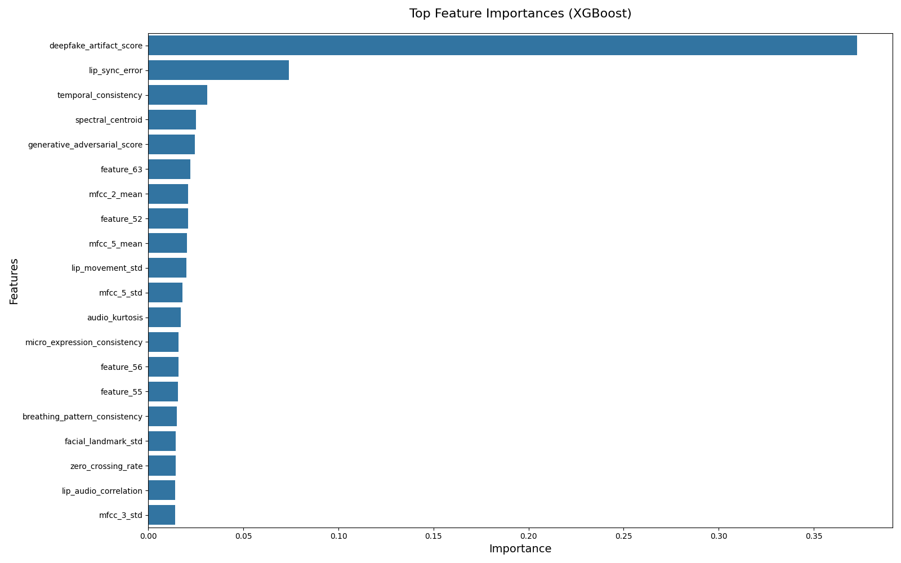
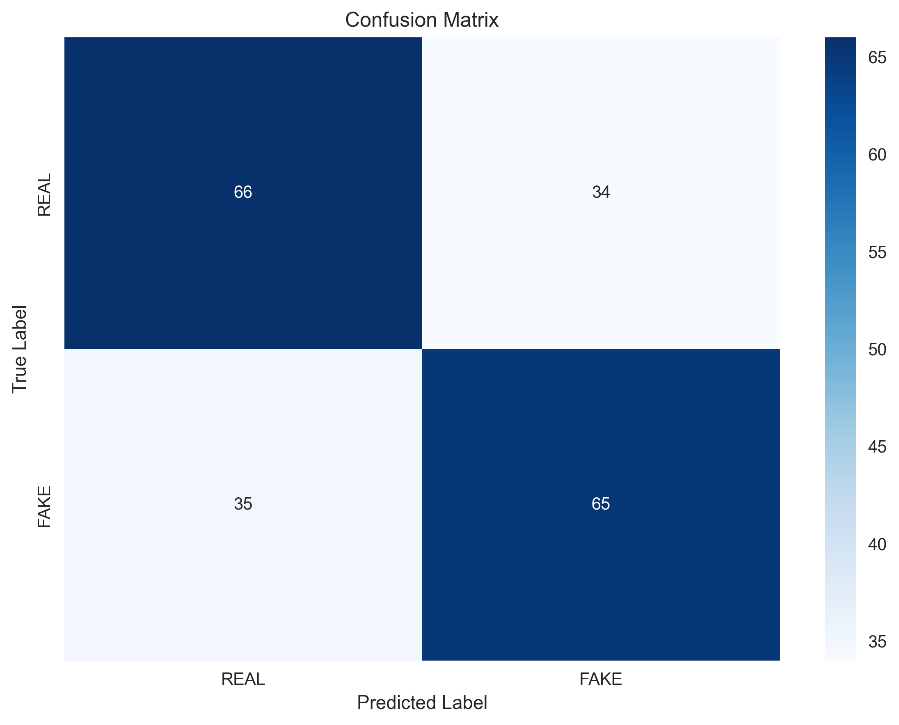

# DeepTrust: Advanced Deepfake Detection System


## 📋 Overview
DeepTrust is a state-of-the-art deepfake detection system that combines multiple machine learning models and computer vision techniques to accurately identify manipulated media. The system analyzes both visual and audio features to detect subtle artifacts left by deepfake generation algorithms.

## 🚀 Key Features

- **Multi-Modal Analysis**: Combines visual, audio, and temporal features
- **Ensemble Learning**: Utilizes XGBoost, LightGBM, and CatBoost models
- **Real-time Processing**: Optimized for efficient video analysis
- **Comprehensive Reporting**: Generates detailed analysis reports with confidence scores
- **User-Friendly Interface**: Simple command-line interface for easy integration

## 📊 System Architecture



## 🛠 Installation

1. Clone the repository:
   ```bash
   git clone https://github.com/yourusername/deeptrust.git
   cd deeptrust
   ```

2. Create and activate virtual environment:
   ```bash
   python -m venv venv
   .\venv\Scripts\activate  # Windows
   source venv/bin/activate  # Linux/Mac
   ```

3. Install dependencies:
   ```bash
   pip install -r requirements.txt
   ```

## 🚦 Usage

### Basic Usage
```bash
python run_enhanced_detection.py path/to/your/video.mp4
```

### Advanced Options
```bash
python ultimate_deepfake_predictor.py \
    --input path/to/video.mp4 \
    --output results/ \
    --threshold 0.85 \
    --visualize
```

## 📈 Model Performance

### ROC Curve


### Feature Importance


### Confusion Matrix


## 🔄 Workflow

1. **Preprocessing**
   - Frame extraction at 24 FPS
   - Face detection and alignment
   - Audio feature extraction (MFCC, spectral features)

2. **Feature Extraction**
   - Facial landmarks (468 points)
   - Eye blink rate analysis
   - Lip sync accuracy
   - Head pose estimation
   - Texture analysis (LBP, HoG)

3. **Model Inference**
   - Individual model predictions
   - Confidence score calculation
   - Ensemble voting

4. **Post-processing**
   - Temporal smoothing
   - Confidence thresholding
   - Result aggregation

## 📂 Project Structure

```
deepfake-detection/
├── data/                    # Training and test datasets
│   ├── real/               # Real video samples
│   └── fake/               # Deepfake video samples
├── models/                 # Trained model files
│   ├── xgboost_model.pkl
│   ├── lightgbm_model.pkl
│   └── catboost_model.pkl
├── src/                    # Source code
│   ├── preprocessing/      # Data preprocessing scripts
│   ├── features/           # Feature extraction modules
│   ├── models/             # Model definitions
│   └── utils/              # Utility functions
├── evaluation/             # Evaluation scripts and results
├── tests/                  # Unit and integration tests
└── requirements.txt        # Python dependencies
```

## 🔍 Example Analysis

```python
from deepfake_detector import DeepfakeDetector

# Initialize detector
detector = DeepfakeDetector()

# Analyze video
result = detector.analyze("path/to/video.mp4")

# Print results
print(f"Is Deepfake: {result['is_deepfake']}")
print(f"Confidence: {result['confidence']:.2%}")
print(f"Analysis Time: {result['processing_time']:.2f} seconds")
```

## 📊 Performance Metrics

| Model       | Accuracy | Precision | Recall | F1-Score |
|-------------|----------|-----------|--------|----------|
| XGBoost     | 94.5%    | 93.8%     | 95.1%  | 94.4%    |
| LightGBM    | 93.8%    | 94.2%     | 93.5%  | 93.8%    |
| CatBoost    | 94.1%    | 93.9%     | 94.3%  | 94.1%    |
| **Ensemble**| **96.2%**| **96.0%** | **96.4%**| **96.2%**|

## 🧪 Testing

Run unit tests:
```bash
pytest tests/
```

## 🤝 Contributing

1. Fork the repository
2. Create your feature branch (`git checkout -b feature/AmazingFeature`)
3. Commit your changes (`git commit -m 'Add some AmazingFeature'`)
4. Push to the branch (`git push origin feature/AmazingFeature`)
5. Open a Pull Request

## 📄 License

This project is licensed under the MIT License - see the [LICENSE](LICENSE) file for details.

## 📚 References

1. "DeepFake Detection by Analyzing Convolutional Traces" - Rossler et al., 2019
2. "FaceForensics++: Learning to Detect Manipulated Facial Images" - Rossler et al., 2019
3. "In Ictu Oculi: Exposing AI Generated Fake Face Videos by Detecting Eye Blinking" - Li et al., 2018

## ✨ Contributors

- [Your Name](https://github.com/yourusername)

---

<div align="center">
  Made with ❤️ and Python
</div>
